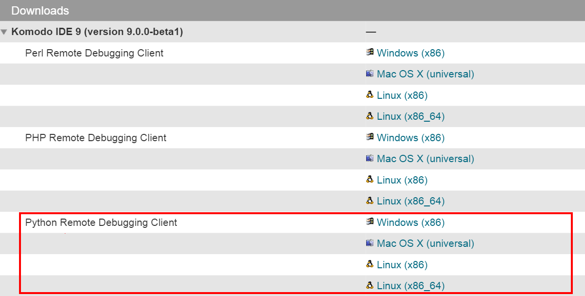
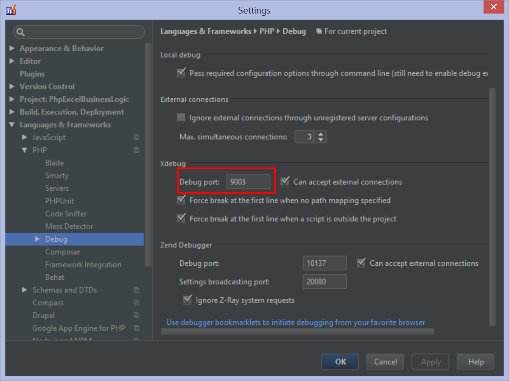
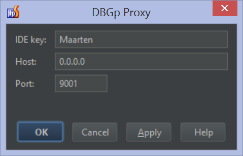

# Multi-user debugging in intellij with Xdebug and DBGp proxy #

## 1.安裝Xdebug到裝好php的機器上 ##
```
apt-get install php5-xdebug
```

## 2.安裝DBGp proxy ##
* 安裝python dbgp套件
```
apt-get install python-pip
pip install dbgp
```
* 下載   
[下載頁面](http://code.activestate.com/komodo/remotedebugging/)

```
wget http://downloads.activestate.com/Komodo/releases/9.3.1/remotedebugging/Komodo-PythonRemoteDebugging-9.3.1-88153-linux-x86_64.tar.gz
tar -zxvf Komodo-PythonRemoteDebugging-9.3.1-88153-linux-x86_64.tar.gz
cd Komodo-PythonRemoteDebugging-9.3.1-88153-linux-x86_64
```
* 啟動DBGp proxy
./pydbgpproxy -d ```IDE-PORT``` -i ```DEBUG-PORT```  
例:
```
./pydbgpproxy -d 127.0.0.1:9000 -i 192.168.1.22:9001
```

## 3.設定分享器 ##
進入分享器設定頁面，在虛擬伺服器頁面，為每個使用者設定一個DBGp proxy連入的port

## 4.設定Intellij IDEA ##
* 設定DBGp proxy連入的port (分享器開的port)
    * 打開File => Settings -> Languages & Frameworks -> PHP -> Debug
    
* 設定要連接的DBGp proxy
    * 按上方的Tools -> DBGp Proxy -> Configuration...
    
* 註冊IDE
    * 按上方的Tools -> DBGp Proxy -> Register IDE
